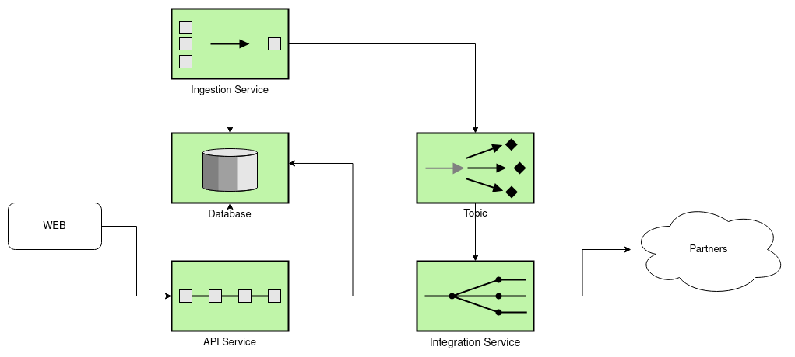

# GUASCA

Guasca é um projeto para estudo da linguagem GO, tendo os seguintes requisitos:
 
- Disponibilizar apis com todos os dados de catálogo: produtos, sku, preço, estoque.
- Atuar de forma passiva, recebendo atualizações de catálogo, atualizando seu banco de dados.
- Enviar atualizações para os parceiros nos formatos esperados por cada um.
- Alto throughput consumindo o mínimo de recursos possível.
- Fácil escalabilidade.

